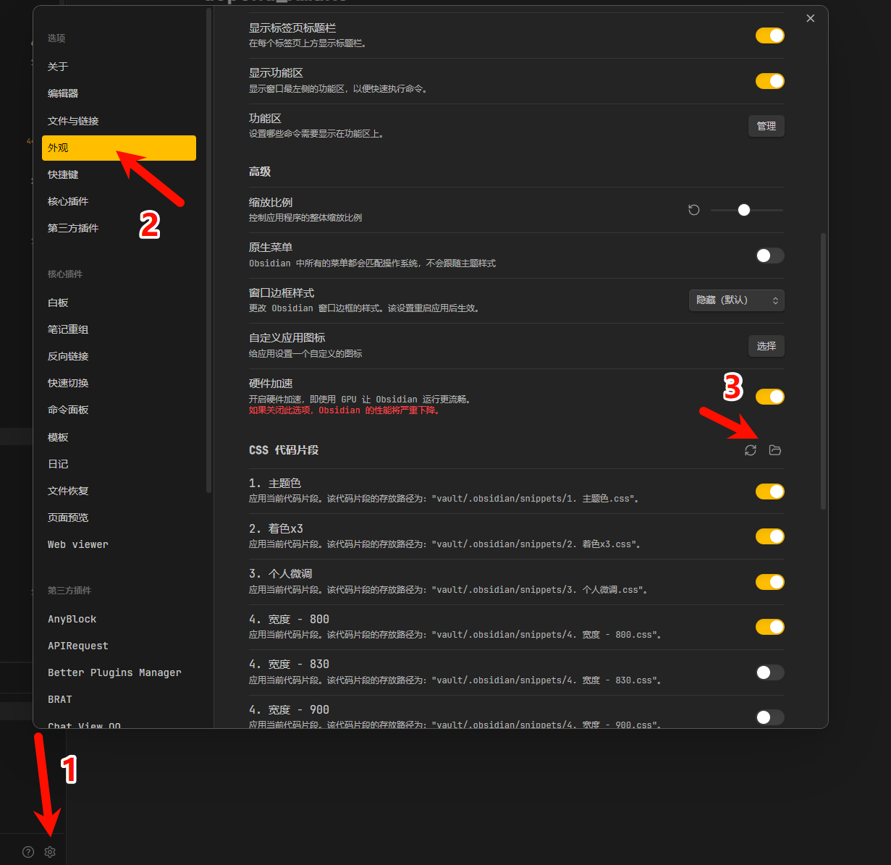
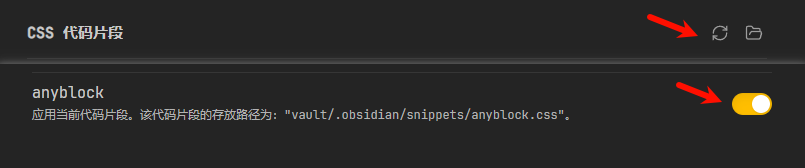

# 如何修改样式

## 在哪个位置进行修改？

1. (不推荐) 进入插件所在文件夹，修改其 `styles.css`。这样的话插件如果有样式方面的更新，会出现问题
2. (推荐) Obsidian设置 > 外观 > CSS代码片段，在这里添加和编辑css内容。后文会有具体的教程
3. (推荐) 不修改原有的插件内部class，而是使用 `addClass()` 处理器添加新class，然后再根据自己的新class去修改外观

不会CSS？简易教程见：https://www.runoob.com/css/css-tutorial.html

## 一个具体步骤示例

1. 创建css片段

首先进入css片段文件夹，并创建css片段



并在该文件夹创建一个文件：`anyblock.css` (名字任意起)，这就是css片段文件

然后进入编辑 (可以用记事本)

2. 添加css内容

例如我们修改tab标签的颜色 (可以添加css)

```css
.theme-dark { /* 黑暗模式 */
    --ab-tab-root-bg-color: red; /* 修改css变量的内容 */
}

.theme-light { /* 明亮模式 */
   --ab-tab-root-bg-color: blue;
}

/* 或者直接添加css内容 */

div, p, span {
    color: green !important; /* 把所有字体都改成绿色 */
}
```

3. 启用css片段

返回ob设置的地方，刷新就能看到刚刚添加的css片段。然后开启就生效了



## 修改css注意项

如果有css变量，推荐修改css变量优先


